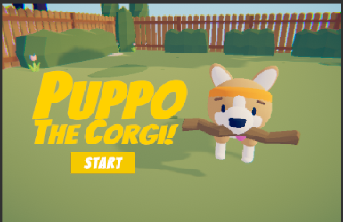
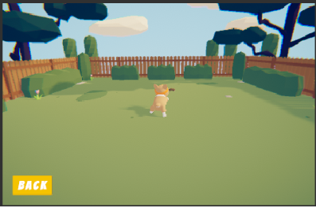
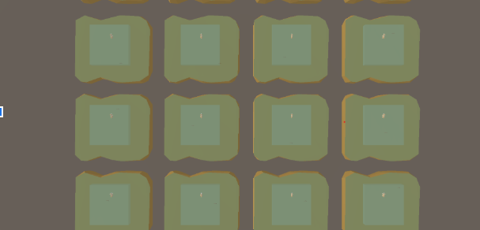

# ML Agents Tutorial


## Overview

The goal of this lab will be to familiarize you with the tools used to perform machine learning in unity and train a model yourself. To that end, it is important to know a few key definitions. From a high level perspective, an **Agent**, as shown in the image below, performs actions that influence the environment. Based upon that action, the environment's state may change. The state of the environment may lead to a **reward** for the Agent, encouraging future Agents to perform the same actions.


Now, Agents do not control their own actions. Those are decided by **Brains**. Brains have four different modes:
 * Internal: Decisions are made by trained models embedded in the project. This is what we will be using.
 * External: Decisions are made through communication with a Python library.
 * Player: Decisions are determined by user input.
 * Heuristic: Decisions are determined by yours or someone else's coded behavior.
In your model, one Brain will make the decisions for a number of different agents.

Finally, we have **Academies**. You should have a single Academy even when you have many Brains, as an Academy governs the environment as a whole, and each Brain should be a child of that Academy. The only exception would be if you want to have several environments with different configurations happening in the same build and training, which is almost certainly bad programming practice but could be useful at times. You shouldn't have to worry too much about Academies unless you look behind the scenes- the only adjustments you should be making to them are factors such as the time-scale and the dimenions of the training window.

## Setup

* Github and Terminal Usage


 1. For Mac users: First, open up your Terminal. For Windows users: Do not try to use the Command Line on Windows. Search for PowerShell and the appropriate terminal will open up.
 2. You can navigate through the Terminal using the commands `cd` and `ls`. Enter `ls` to see files within your current directory (possibly known to you as a folder). Type `cd` followed by the exact name of a directory within your current directory to move inside there. A quick google search can help you figure out the other uses of `cd` to navigate. Now, create a directory where you would like using the command `mkdir` followed by the name of the new directory (which you can choose). This will be the home of your machine learning projects for this course. While this doesn’t have to be done through the Terminal, it’s good practice. Type `cd` followed by the name of the new directory to navigate there.
 3. Go to [github.com](http://github.com) and create an account if you don’t have one.
 4. Go to [this link](https://git-scm.com/downloads) to download Git for your computer if you haven’t already.


* Python Libraries and ML-Agents


The following instructions are adapted from [this](https://github.com/Unity-Technologies/ml-agents/blob/0.5.0/docs/Installation.md) page
 1. In your Terminal, in the new directory you created, type `git clone https://github.com/Unity-Technologies/ml-agents.git`. THis iwll add a copy of Unity's Machine Learning public repositiory to your current directory
 2. Click [here](https://docs.anaconda.com/anaconda/install/) to install Anaconda
 3. Install Python 3.6 (note the version) using [this](https://www.python.org/downloads/) link. If using a Max or Linux, you may only need to then run `pip install .` in your ml-agents directory that you cloned. If some of your dependencies are out of date or too advanced, look at step 6 for Windows users and try the same steps.
 4. In your Anaconda prompt: `run conda create -n ml-agents python=3.6`. Enter `y` whenever prompted. This will create an environment which you will need to activate by running `activate ml-agents` when you want to train your models.
 5. For Windows users:  run `pip install tensorflow==1.7.1`
 6. For Windows users: In theory all you need to do now is run `pip install .` but you will probably not be so fortunate. After you run this command, you will likely see a message like this: `ERROR: mlagents-envs 0.8.2 has requirement cloudpickle==0.8.1, but you'll have cloudpickle 1.2.1 which is incompatible.` For each such message, run `pip install` followed by the correct version. For instance, here I would type `pip install cloudpickle==0.8.1`


## Step-By-Step

First, you will use the model of Puppo the Corgi trained by Unity. Then, you will train and run your own.

* Running the Default Model
 1. Open Unity. Open the Scene Fetch under Assets/PuppoTheCorgi/Fetch/Scenes
 2. Go to the Academy object, then to its child DogBrain. Make sure Brain Type is set to Internal and that Graph Model is set to Fetch-Model
 3. You’re all set! Most of the work has already been done for you. To play the game, click play, then Start, and grab the stick with your mouse and throw it.



* Training Your Own Model
 1. Go to ml-agents/config. You should see a file named trainer_config.yaml
 2. Use any text editor (my favorite is [VS Code](https://code.visualstudio.com/)) to **add** the following configurations to the .yaml file. Note that the max_steps variable controls how long your model trains for. The default is about 1/4 the time and yields noticeably poorer results, as one would expect.

```
DogBrain: 
 normalize: true 
 num_epoch: 3 
 time_horizon: 1000 
 batch_size: 2048 
 buffer_size: 20480 
 gamma: 0.995 
 max_steps: 2e6 
 summary_freq: 3000
 num_layers: 3 
 hidden_units: 512
```
 3. In the same place where you found the Fetch scene, open TrainingScene
 4. In Unity, build the project with only TrainingScene. I named my executable from the build Fetch
 5. You are now ready to begin training. In the Anaconda prompt, under the ml-agents directory, with ml-agents activated, run `mlagents-learn config/trainer_config.yaml --env=../Fetch.exe --run-id=myFirstTraining --train`. Note: This assumes that you haven’t renamed the trainer_config file or Fetch.exe, and the choice of the run-id is arbitrary. Working on a different project, you’ll have to adjust this command with the appropriate file names.
 6. It might take a little while to execute, and once it’s done, the wait isn’t over. A file should open up to an image that looks like this:
 
 7. The longer you wait, the better your results will be. Unity’s machine learning is governed by rewards. In your terminal, you should see a series of lines that look like this: 

```
INFO: 
 mlagents.trainers: 
  firstRun-0: 
   DogBrain: 
    Step: 2000. 
    Mean Reward: 1.850. 
    Std of Reward: 0.788. 
    Training.
```
This is is one of my earliest results. Here’s one of my later ones:
    
```
INFO: 
 mlagents.trainers: 
  firstRun-0: 
   DogBrain: 
    Step: 48000. 
    Mean Reward: 3.479. 
    Std of Reward: 1.480. 
    Training.
```
As you can see, the mean reward increased substantially.

 8. Now that you’ve done some training, try your new model. Make sure that the folder outputted by the training (it should be named after your run-id) is in the Assets folder of your Unity project. Back in Unity, go to the Fetch scene, go to DogBrain under Academy, and change the Graph-Model to the .bytes file in the training folder.


## Summary


## Resources to Consult if Issues Arise

Agents, Brains, and Academies: [Click here](https://blogs.unity3d.com/2017/09/19/introducing-unity-machine-learning-agents/?_ga=2.12913719.1204716044.1564507456-955964214.1562636155)

ML-Agents: [Click here](https://github.com/Unity-Technologies/ml-agents/blob/0.5.0/docs/Installation.md)
